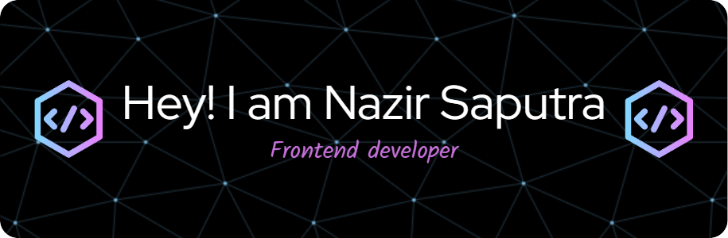

<!-- # Hello I'm Nazir Saputra 🙌 -->

<!-- I'm a passionate **Frontend Developer** and tech enthusiast who loves building interactive web applications with modern technologies.

---

## 🚀 Tech Stack

- 🌐 Frontend: HTML, CSS, JavaScript, React, Next.js, Tailwind CSS
- 💻 Backend: Node.js, Express, Laravel
- 🛢️ Database: MySQL, MongoDB, Firebase
- ⚙️ Tools: Git, GitHub, VS Code, Postman

---

##### Skills

---

##### My Github Stats

---

## 📫 Let's Connect With Me!

  -->

## Hello I'm Nazir Saputra 🙌

##### 🌐 Socials:
 

##### 💻 Tech Stack:
   

##### 📊 GitHub Stats:
 
 

###### 🏆 GitHub Trophies

##### 🔝 Top Contributed Repo

---

<h2 align="left">Play Game with me</h2>

<!-- <picture>
  <source media="(prefers-color-scheme: dark)" srcset="https://raw.githubusercontent.com/nazirsaputra26/nazirsaputra26/output/pacman-contribution-graph-dark.svg">
  <source media="(prefers-color-scheme: light)" srcset="https://raw.githubusercontent.com/nazirsaputra26/nazirsaputra26/output/pacman-contribution-graph.svg">
  
</picture> -->

###

<!-- Proudly created with GPRM ( https://gprm.itsvg.in ) -->
